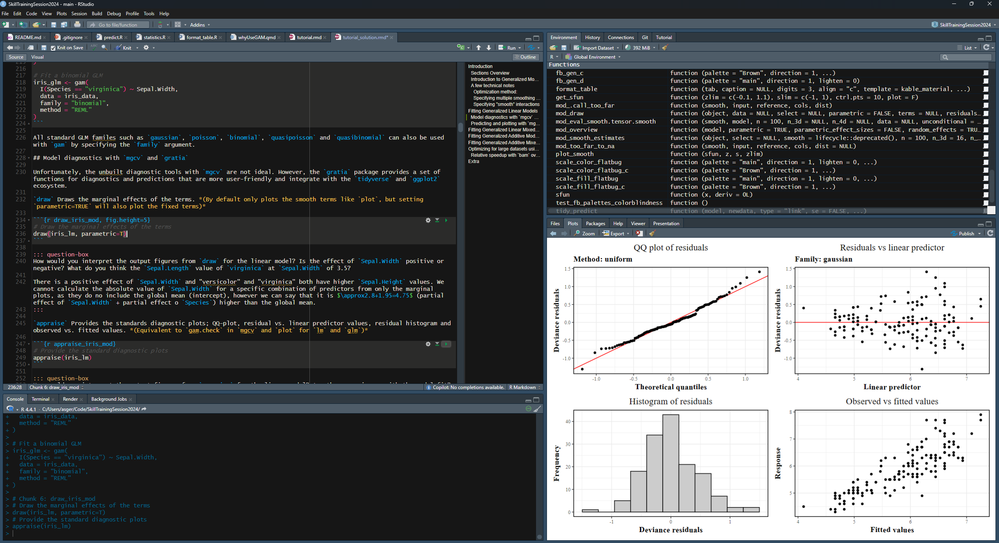
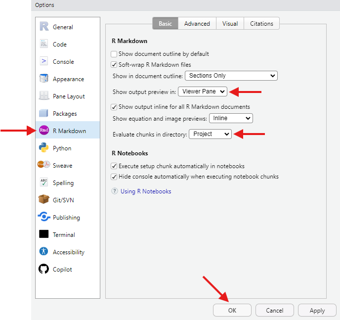
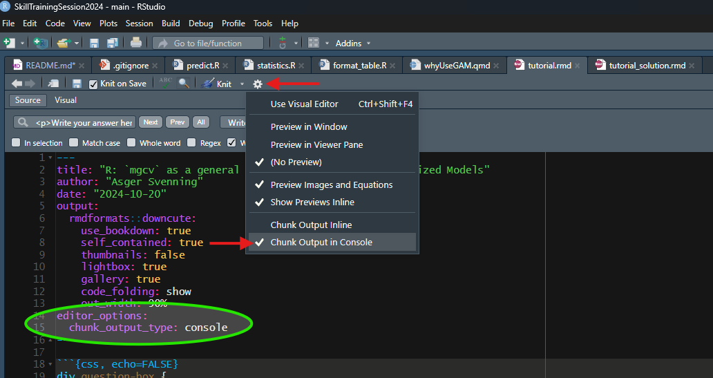
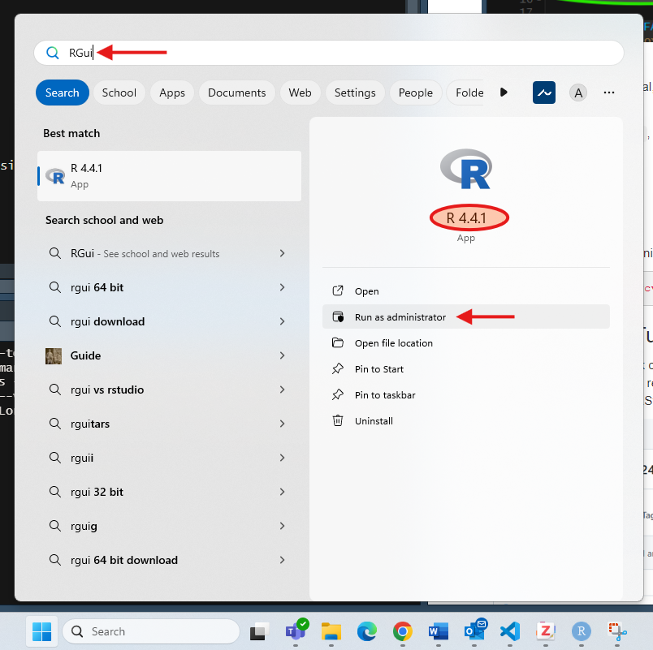
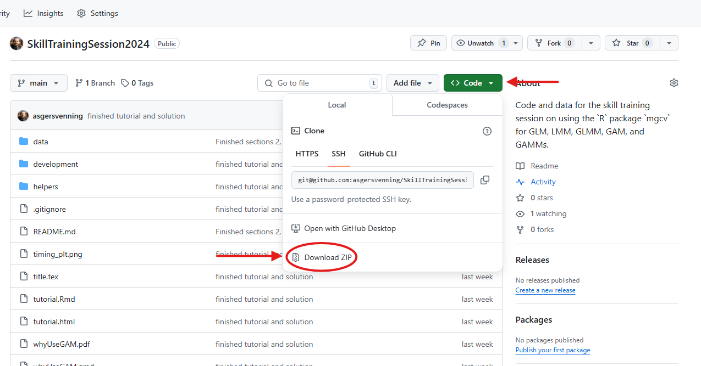

# R: `mgcv` as a General Framework for (Most) Generalized Models

This repository contains the materials for a skill training session on using the R package `mgcv` to model various types of generalized models, including Generalized Linear Models (GLMs), Generalized Additive Models (GAMs), Generalized Linear Mixed Models (GLMMs), and Generalized Additive Mixed Models (GAMMs). 
The session is designed for early-career researchers and PhD students, aiming to unify these models under the `gam`/`bam` functions from `mgcv`.

## Overview

The session is structured around hands-on exercises using three practical datasets, with a focus on:

-   Choosing the appropriate model family (`ziP`, `betar`, `gaullss`, etc.).
-   Understanding and applying different smoothing functions.
-   Visualizing model predictions and diagnostics (e.g., marginal and residual plots, QQ plots).
-   Efficiently using `gam`/`bam` for large datasets.

### Contents

-   **data/**: Contains the datasets used in the session.
-   **tutorial.Rmd**: The RMarkdown tutorial that guides participants through the exercises.
-   **results/**: Folder for where the results produced in the excercises are stored.
-   **helpers/**: Helper functions for the tutorial.
-   **development/**: Contains code for developing the tutorial. *(And a proposed solution of the tutorial by me)*

### Setup

Before starting, ensure you have `R` installed on your computer. You can download it [here](https://cran.r-project.org/).

This tutorial is designed for use with **RStudio**, an integrated development environment (IDE) for `R`. Download **RStudio** [here](https://www.rstudio.com/products/rstudio/download/).

<p align="center">
  
</p>

### RStudio Settings
There are a few options in RStudio that can make your life easier when working with RMarkdown files. You can find these settings under `Tools` → `Global Options` → `R Markdown`.

Particularly, I recommend setting `Evaluate chunks in Directory` → `Project` and `Show output preview in` → `Viewer Pane`:

<p align="center">
  
</p>

And then set the *`editor_option`* `chunk_output_type` to `console` (I have done this for you already in the tutorial):

<p align="center">
  
</p>

#### Required `R` Packages

To follow along with the tutorial, you will need the following `R` packages:

-   `mgcv`
-   `tidyverse` (`ggplot2`, `dplyr`, `stringr`)
-   `gratia`
-   `magrittr`
-   `kableExtra`
-   `rmdformats`
-   `xfun`

Install these packages by running the following command in **RGui** (make sure to select the correct version, if you have multiple versions of `R` installed) or a terminal with administrative privileges (ensure **RStudio** is closed):

``` r
install.packages(c("mgcv", "tidyverse", "gratia", "magrittr", "kableExtra", "rmdformats", "xfun"))
```

<p align="center">
  
</p>

### How to Use the Tutorial

-   (optional) Create a fork of this repository.
-   Download or clone this repository (or the fork).
-   Open tutorial.Rmd in RStudio.

<p align="center">
  
</p>

Work through the tutorial, filling in the code where indicated and answering questions along the way. Run the code blocks in RStudio to see the outputs, predictions, and diagnostics visualized in real-time.

(optional) If you forked the repository, you can push your changes to your fork to save your progress, and allow others - me included - to see your work.

### Contact

For any issues, feel free to open an issue in this repository or contact me at [asgersvenning\@ecos.au.dk](mailto:asgersvenning@ecos.au.dk){.email}.
