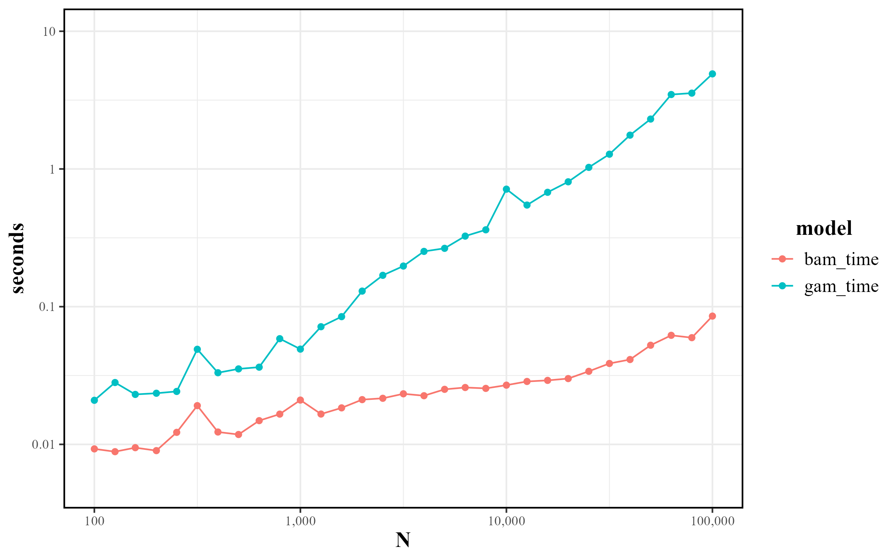

```{css, echo=FALSE}
div.question-box {
    width: 75%;
    margin: 10px auto;
    padding: 5px;
    border: 3px solid var(--code-block-background);
    border-radius: 15px;
    background: var(--success-color);
    color: var(--text-color);
    font-size: medium;
    
    p {
      padding: 10px;
      margin: 0;
      font-style: italic;
      color: color-mix(in hwb, var(--text-color), var(--page-background) 15%);
    }
    
    p:first-child:before {
      content: "Question: ";
      font-style: normal;
      font-weight: bold;
    }
    
    p ~ p:before {
      content: "Answer: ";
      font-style: normal;
      font-weight: bold;
    }
}

.page-content h1 {
  margin-top: 3rem;
}
```


```{r}
#| setup, include=FALSE

Sys.setlocale(category="LC_TIME", locale="English_United States.1252")
Sys.setenv(LANG="en")
knitr::opts_chunk$set(
  echo = TRUE, 
  cache = TRUE,
  fig.width = 10, 
  fig.height = 10, 
  fig.align = "center", 
  out.width = "90%",
  dev="png", 
  dpi=200
)

library(tidyverse)
library(mgcv)
library(gratia)
library(kableExtra)
library(patchwork)

source("../helpers/predict.R")
source("../helpers/statistics.R")
source("../helpers/format_table.R")

theme_set(
  theme_bw() +
    theme(
      text = element_text(family = "serif"),
      strip.text = element_text(hjust = 0.5, size = 14, face = "bold"),
      strip.text.y.right = element_text(angle = 0),
      strip.text.y.left = element_text(angle = 0),
      title = element_text(hjust = 0.5, size = 14, face = "bold"),
      plot.title = element_text(hjust = 0.5, size = 16, face = "plain"),
      legend.title = element_text(hjust = 0.5),
      legend.text = element_text(size = 12),
      panel.border = element_rect(color = "black", linewidth = 1)
    )
)

rm_titles <- theme(
  axis.title = element_blank(),
  plot.title = element_blank(),
  plot.subtitle = element_blank()
)
```

**REFERENCES**

This tutorial was developed using the following resources:

-   <https://peerj.com/articles/6876/>
-   <https://fromthebottomoftheheap.net/2021/02/02/random-effects-in-gams/>
-   <https://lter.github.io/lterdatasampler/articles/hbr_maples_vignette.html>

# Introduction

Welcome to the `mgcv` skill training session! In this tutorial, we will explore how to use the R `mgcv` package as a unified framework for modeling various types of generalized models, including Generalized Linear Models (GLMs), Linear Mixed Models (LMMs), Generalized Linear Mixed Models (GLMMs), Generalized Additive Models (GAMs), and Generalized Additive Mixed Models (GAMMs).

By the end of the session, you will have gained practical experience in:

-   Selecting the appropriate model type (GLM, LMM, GAM, GLMM, GAMM) and family (e.g., `ziP`, `betar`, `gaullss`).
-   Fitting and parameterizing models using the `mgcv` package.
-   Visualizing key diagnostics, including residual plots, QQ plots, and fitted values.
-   Optimizing model performance for larger datasets using `bam`.

## Sections Overview

This tutorial is divided into the following sections:

1.  **Introduction to Generalized Models and Smoothing Functions**\
    We will start by discussing the range of models that can be fitted using `mgcv`, including GLMs, LMMs, GLMMs, GAMs, and GAMMs. You will also learn about the available families and smoothing functions in `mgcv`.

2.  **Fitting Generalized Linear Models (GLM)**\
    In this section, we will fit basic GLMs to datasets using different families, such as Poisson for count data and binomial for binary data.

3.  **Fitting Linear Mixed Models (LMM) and Generalized Linear Mixed Models (GLMM)**\
    This section covers fitting LMMs and GLMMs to handle grouped data and random effects.

4.  **Fitting Generalized Additive Models (GAM) and Generalized Additive Mixed Models (GAMM)**\
    We will extend GLMs and GLMMs by incorporating smoothing terms for continuous predictors, resulting in GAMs and GAMMs.

6.  **Optimizing for Large Datasets Using `bam`**\
    For large datasets, the `bam` function in `mgcv` provides computational efficiency. This section will focus on optimizing model fitting for larger datasets.

## Introduction to Generalized Models and Smoothing Functions

`mgcv` provides a unified framework for modeling a wide range of statistical models, including:

-   **Generalized Linear Models (GLMs)**: A generalization of linear regression, allowing for different types of response distributions (e.g., Poisson, binomial).
-   **Linear Mixed Models (LMMs)**: Extends linear models by incorporating random effects to account for grouped data.
-   **Generalized Linear Mixed Models (GLMMs)**: Extends GLMs by including random effects.
-   **Generalized Additive Models (GAMs)**: Extends GLMs by allowing nonlinear relationships through smoothing functions.
-   **Generalized Additive Mixed Models (GAMMs)**: Combines GAMs and GLMMs, allowing for both smoothing and random effects.

Common families in `mgcv` include:

-   **Gaussian**: For continuous, normally distributed data.
-   **Poisson**: For count data.
-   **Binomial**: For binary or proportion data.
-   **Zero-inflated Poisson (`ziP`)**: For count data with excess zeros.
-   **Beta regression (`betar`)**: For data bounded between 0 and 1.
-   **Gaussian location-scale (`gaullss`)**: For modeling the mean and variance simultaneously.
-   **Zero inflated (hurdle) Poisson location-scale (`ziplss`)**: For modelling count and occurrence simultaneously (e.g. presence/absence and abundance).

Smoothing functions available in `mgcv` include:

-   **Thin-plate splines (`bs = "tp"`)**: A flexible, isotropic smoothing function.
-   **Cubic regression splines (`bs = "cr"/"cs"`)**: Penalized/Shrinkage cubic regression splines.
-   **Random effects (`s = "re"`)**: For modeling random effects in Linear, Generalized Linear, and Generalized Additive Mixed Models (LMM/GLMM/GAMM).
-   **Factor smooth interactions (`s = "fs"`)**: For estimating random additive effects in GAMMs.
-   **Gaussian process (`s = "gp"`)**: For interpolating autocorrelated data, also sometimes known as kriging in GIS settings.

## A few technical notes
### Optimization method:
When using `gam` or `bam` in `mgcv`, it is important to specify the `method` argument. The default is `method = "GCV.Cp"`, however unless you need to compare models with different parametric terms, it is recommended to use `method = "REML"` with `gam` and `method = "fREML"` for `bam`:
```{r optim_method}
#| eval: FALSE

# Incorrect
gam(y ~ x, data = data)

# Correct
gam(y ~ x, data = data, method = "REML")
```

### Specifying multiple smoothing functions
Sometimes we might want to specify multiple smoothing functions (bases) for a single term, an example later will come up later in this tutorial where we want a random cyclical smooth effect. `mgcv` doesn't contain a built-in random cyclical smooth basis, however it does contain a random smooth basis and a cyclic smooth basis, these can then be combined by specifying both in the  `bs` argument to  `te()`:
```{r multiple_smooth}
#| eval: FALSE

gam(y ~ te(f, x, bs=c("fs", "cc")), data = data, method = "REML")
```

### Specifying "smooth" interactions
When specifying smooth interactions in `mgcv`, often interaction *can* be specified simply by listing multiple terms inside a single `s()` term. However, this can lead to issues with model identifiability and interpretation. It is often better to separate the main and interaction effects using the `ti()`. The `ti()` function essentially functions as the `:` operator for standard R formulas, but for smooth terms (including random effects):
```{r smooth_interactions}
#| eval: FALSE

# Standard
gam(y ~ s(x, y), data = data, method = "REML")

# Better
gam(y ~ s(x) + s(y) + ti(x, y), data = data, method = "REML")
```

# Fitting Generalized Linear Models

Fitting models with `mgcv` mirrors the base `R` syntax for LMs and GLMs. To illustrate this, we will fit a simple linear model and a binomial GLM to the `iris` dataset.

```{r iris_mod}
iris_data <- iris %>% 
  as_tibble %>% 
  mutate(
    Species = factor(Species)
  )

# Fit a linear model
iris_lm <- gam(
  Sepal.Length ~ Sepal.Width + Species, 
  data = iris_data,
  method = "REML"
)

# Fit a binomial GLM
iris_glm <- gam(
  I(Species == "virginica") ~ Sepal.Width, 
  data = iris_data, 
  family = "binomial",
  method = "REML"
)
```

All standard GLM familes such as `gaussian`, `poisson`, `binomial`, `quasipoisson` and `quasibinomial` can also be used with `gam` by specifying the `family` argument.

## Model diagnostics with `mgcv` and `gratia`

Unfortunately, the unbuilt diagnostic tools with `mgcv` are not ideal. However, the `gratia` package provides a set of functions for diagnostics and predictions that are more user-friendly and integrate with the `tidyverse` and `ggplot2` ecosystem.

`draw` Draws the marginal effects of the terms. *(By default only plots the smooth terms like `plot`, but setting `parametric=TRUE` will also plot the fixed terms)*

```{r draw_iris_mod, fig.height=5}
# Draw the marginal effects of the terms
draw(iris_lm, parametric=T)
```

::: question-box
How would you interpret the output figures from `draw` for the linear model? Is the effect of `Sepal.Width` positive or negative? What do you think the `Sepal.Length` value of `virginica` at `Sepal.Width` of 3.5?

There is a positive effect of `Sepal.Width` and "versicolor" and "virginica" both have higher `Sepal.Height` values. We cannot calculate the absolute value of `Sepal.Width` for a specific combination of predictors from only the marginal plots, as they do no include the global mean (intercept), however we can say that it is $\approx2.8+1.95=4.75$ (partial effect of `Sepal.Width` + partial effect o `Species`) higher than the global mean.
:::

`appraise` Provides the standards diagnostic plots; QQ-plot, residual vs. linear predictor values, residual histogram and observed vs. fitted values. *(Equivalent to `gam.check` in `mgcv` and `plot` for `lm` and `glm`)*

```{r appraise_iris_mod}
# Provide the standard diagnostic plots
appraise(iris_lm)
```

::: question-box
How would you interpret the output figures from `appraise` for the linear model? Are there any issues with the model fit?

The QQ-plot and residual histogram indicate that the residuals are reasonably close to normality, while the residuals vs. linear predictor (fitted) plot doesn't seem to show significant heteroscedacity or trends. We can thus be reasonably confident that the model is well-fitted. The observed vs. fitted plot also shows that the model as pretty good predictive power. 
:::

## Predicting and plotting with `mgcv`, `gratia` and `ggplot2`

`fitted_values`/`add_fitted_samples` Adds the fitted values to a `tibble`(`data.frame`).

```{r predict_iris_mod}
# Add the fitted values to the data
fd1 <- fitted_values(iris_lm, iris_data)
fd2 <- add_fitted_samples(iris_data, iris_lm, n = 100)
```

```{r}
#| class.source: 'fold-hide'

fd1 %>% 
  head %>% 
  format_table(
    caption = "Result of `fitted_values(lm_iris, iris_data)`"
  )
    
fd2 %>% 
  head %>% 
  format_table(
    caption = "Result of `add_fitted_samples(iris_data, lm_iris, n = 100)`"
  )
```

```{r}
#| class.source: 'fold-hide'
#| fig.height: 5
#| fig.width: 6
#| fig.cap: "Fitted values and samples for `lm_iris`"

fd1 %>% 
  ggplot(aes(x = Sepal.Width, color = Species)) +
  geom_point(aes(y = Sepal.Length)) +
  geom_line(aes(y = .fitted), linewidth = 1, show.legend = F) +
  geom_ribbon(
    aes(ymin = .lower_ci, ymax = .upper_ci),
    alpha = 0.15,
    linewidth = 0,
    show.legend = F
  ) +
  geom_line(
    data = fd2, 
    aes(y = .fitted, group = paste0(Species, .draw)), 
    linewidth = 0.5, 
    alpha = 0.15,
    show.legend = F
  ) +
  coord_cartesian(expand = F)
```

And `overview` provides a tidy summary of both the fixed (parametric), smooth, random etc. effects. *(Here we will use a modified version called `mod_overview`, hopefully it will be part of `gratia`)*

```{r}
tab_iris_lm <- iris_lm %>% 
  mod_overview(accuracy = 0.00001, parametric_effect_sizes = T, stars = T) %>% 
  select(!c(k, edf)) # only relevant when the model includes smooth terms

tab_iris_lm %>% 
  format_table(
    caption = "Linear model on `iris` summary",
    align = "rcccccc"
  )
```

::: question-box
Could you see yourself using `mgcv` for simple linear models in the future? Why or why not?

I could see myself using it yes, but probably not if I am *only* considering LMs. However, if I am already dipping my toes into GLMs/GAMs, I am very inclined to swap before it is techincally necessary, just because I know there is a high likelihood that I will need to anyways in the future. 
:::

# Fitting Generalized Linear Mixed Models

`mgcv` can also fit mixed models, including Linear Mixed Models (LMMs) and Generalized Linear Mixed Models (GLMMs). To illustrate this, we will fit a simple LMM and GLMM to the `hbr_maples` dataset from `lterdatasampler`.

```{r hbr_maples}
maple_data <- lterdatasampler::hbr_maples %>%
  mutate(
    year = factor(year),
    elevation = elevation %>% 
      as.character %>% 
      replace_na("High") %>% 
      factor(c("Low", "Mid", "High"))
  ) 
```

The dataset contains stem and leaf measurement data for Sugar Maple saplings from 12 transects in 2003/2004. In this tutorial we will focus on modeling the relationship between stem dry mass (`stem_dry_mass`) and stem length (`stem_length`). If we plot the data, we can see a linear relationship, but with variation between transects and years. 
```{r hbr_maples_plot}
#| class.source: 'fold-hide'
#| message: FALSE
#| warning: FALSE

maple_data %>% 
  ggplot(aes(stem_dry_mass, stem_length, color=transect, shape=year, linetype=year)) +
  geom_point() +
  geom_smooth(method = "gam", se = F) +
  geom_smooth(aes(group=1), method = "lm", color="black", linetype="solid")
```

::: question-box
What do you think the relationship between `stem_dry_mass` and `stem_length` is? How would you typically model this type of data?

It looks overall positive, but with a large interaction effect on the slope with `year`, and minor deviations within `year` by `transect`. Unless I am specifically interested in the difference between the years, I would probably want to fit a LMM with `year` as a random effect on the slope and `transect` as a random effect on the intercept nested within `year`.
:::

Here we will fit a model like:
$$
\begin{align*}
  \text{stem_length} = \beta\; &+  \\
  \text{stem_dry_mass}\;&+ \\
  \gamma_{year}\; &+ \\
  \gamma_{transect}\; &+ \\
  \gamma_{year} \times \gamma_{transect}\; &+ \\
  \text{stem_dry_mass} \times \gamma_{year}\; &+ \\
  \text{stem_dry_mass} \times \gamma_{transect}\; &+ \\
  \text{stem_dry_mass} \times \gamma_{year} \times \gamma_{transect}\; &+ \\
  \epsilon\; &
\end{align*}
$$

Where $\gamma_{transect}$ and $\gamma_{year}$ are random effects for transect and year, respectively. We can fit this model using the `gam` function in `mgcv`.

```{r hbr_maples_mod}
maple_lmm <- gam(
  stem_length ~ 
    stem_dry_mass +
    s(year, bs="re") +
    s(transect, bs="re") + 
    ti(year, transect, bs="re") + 
    ti(year, stem_dry_mass, bs="re") +
    ti(transect, stem_dry_mass, bs="re") +
    ti(year, transect, stem_dry_mass, bs="re"),
  data = maple_data, 
  family = "gaussian",
  method = "REML"
)
```

::: question-box
Walk through each term in the model formula. What does each term represent and how does it contribute to the model? Focus on the difference between a "naked" term, a term wrapped in `s(...)` and `ti(...)`.

The first term `stem_dry_mass` is simply the main linear term, while the next two `s` terms are the main random effect terms of `year` and `transect` on the intercept, while the first `ti` term captures the difference (interaction) in the random effect of `transect` on the intercept between `year`s. The next two `ti` terms capture the random effect of `year` and `transect` on the slope (coefficient of `stem_dry_mass`), while the last `ti` captures the difference in the random effect of `transect` on the slope between `year`s. 
:::

::: question-box
What is the purpose of the "bs" argument and what does `bs="re"` do?

The `bs` argument of smooth terms (`s`/`ti`/`te`) specify which *type* of smooth term it is, in this case "re" is short for "**r**andom **e**ffect".
:::

Let's verify the model fit using the `appraise` function.
```{r hbr_maples_appraise}
appraise(maple_lmm)
```
This isn't perfect, but I'll leave it as an exercise to the reader to improve the model fit. *(Hint: try different terms and families)*

::: question-box
How would you interpret the output figures from `appraise` for the LMM model? What is the main issue with the model fit and what effect does it have on the interpretation of the model?

Looking at the QQ-plot we can see that the residuals aren't quite normal, while the residuals vs. linear predictor plot exhibits some heteroscedasticity as the variance seems to decrease with the linear predictor. Looking at the residual histogram and fitted vs. response plot, we can see that the residuals tend to be heavy-tailed to the right (top), indicating that we might need to use a different family (and or that the main relationship isn't linear). 
:::

We can then inspect the results using the `mod_overview` function.
```{r}
#| class.source: 'fold-hide'

tab_maple_lmm <- maple_lmm %>% 
  mod_overview(parametric_effect_sizes = T, stars = T)  

tab_maple_lmm %>% 
  format_table(
    caption = "LMM on `lterdatasampler::hbr_maples` summary",
    align = "rcccccc"
  )
```

::: question-box
How would you interpret the output of `mod_overview` for the LMM model? What is the effect of `stem_dry_mass` on `stem_length`, and does it depend on the year, transect or both?

Our model estimates an intercept of $\sim 60$, significantly different from zero, which doesn't seem too logical. We also estimate that every unit of `stem_length` weighs $\sim 575$ units of `stem_dry_mass`. There also seem to be a significant variation in mean and slope between `year`s, but not `transect`s (or their interaction).
:::

And again, we will plot the fitted values using `fitted_values` and `ggplot2`. However, this time we want to visualize the main effect of `stem_dry_mass` without the random effects, as well as the full model with the random effects. We do this by using the `exclude` argument in `fitted_values`, the names of the terms to exclude can be found in the output of `mod_overview`.

```{r hbr_maples_predict}
maple_lmm_pred_main <- fitted_values(
  maple_lmm,
  exclude=c(
    "s(year)",
    "s(transect)",
    "ti(year,transect)",
    "ti(year,stem_dry_mass)",
    "ti(transect,stem_dry_mass)",
    "ti(year,transect,stem_dry_mass)"
  )
) %>% 
  bind_cols(select(maple_data, !any_of(names(.)))) 

maple_lmm_pred_all <- fitted_values(maple_lmm) %>%
  bind_cols(select(maple_data, !any_of(names(.))))
```

```{r hbr_maples_plot_pred}
#| class.source: 'fold-hide'

maple_lmm_pred_main %>%
  ggplot(aes(stem_dry_mass, .fitted, ymin=.lower_ci, ymax=.upper_ci)) +
  geom_point(aes(y=stem_length, color=transect)) +
  geom_line(
    data = maple_lmm_pred_all,
    aes(color = transect, linetype=year),
  ) +
  geom_line() +
  geom_ribbon(alpha=0.2) +
  coord_cartesian(expand=F) +
  labs(y = "Stem Length", x = "Stem Dry Mass") 
```

::: question-box
What is your immediate impression of the model fit from the plot? Does this visualization change your interpretation of the diagnostic plots from earlier?

No, the model seems to underfit the difference between `year`s, but otherwise seems reasonable. 
:::

# Fitting Generalized Additive Models
This section will cover the core functionality of `mgcv` (and  `gratia`) - fitting Generalized Additive Models (GAMs). GAMs are a generalization of GLMs that allow for nonlinear relationships between predictors and the response variable. One of the major strengths of `mgcv` is that it allows for the inclusion of smooth terms, while not being prone to overfitting due to the use of penalization. 

To explore the functionality of `mgcv` we will use the `knz_bison` dataset from `lterdatasampler`. The dataset contains weight and age measurements for male and female bison from the Konza Prairie Biological Station.

```{r}
#| class.source: 'fold-hide'

head_knz_bison <- lterdatasampler::knz_bison %>% 
  head 

head_knz_bison %>% 
  format_table(
    caption = "First few rows of `knz_bison`",
  )
```

Unfortunately the age of the animal in the supplied data has been rounded, leading to very few unique values of the age. This is very problematic for modelling in general and especially for GAMs. To get around this we will assume that the weight gain of an animal between measurements can be approximated by a linear interpolation of the weight measurements. We then sample the same number of observations from the original dataset, but at uniform continous ages between the minimum and maximum age of the animals and use the interpolated weights as the response variable.

```{r knz_bison_interpolate}
#| warning: FALSE

bison_orig <- lterdatasampler::knz_bison %>% 
  filter(!is.na(animal_weight) & !is.na(animal_yob)) %>%
  group_by(animal_code) %>% 
  filter(n() > 1) %>% 
  ungroup %>% 
  mutate(
    animal_age = rec_year - animal_yob,
    across(c(data_code, animal_code, animal_sex, rec_month, rec_year), factor),
  )

bison_data <- bison_orig %>% 
  group_by(animal_code) %>% 
  reframe(
    across(c(data_code, animal_yob, animal_sex), first),
    inter_data = approx(animal_age, animal_weight, xout=sort(runif(n(), min(animal_age), max(animal_age)))) %>% 
      set_names(c("animal_age", "animal_weight")) %>%
      as_tibble
  ) %>% 
  unnest(inter_data) %>% 
  mutate(
    rec_year = floor(animal_yob + animal_age),
  )
```

This doesn't change the shape of the relationship, but it does make for a better modelling excercise.

```{r knz_bison_plot}
#| class.source: 'fold-hide'
#| fig.height: 5

shared_elements <- list(
  geom_point(size = 1, alpha = 0.25, shape = 16),
  scale_color_brewer(palette = "Set1"),
  coord_cartesian(expand = F),
  labs(x = "Age", y = "Weight (kg)", color = "Sex"),
  guides(
    color = guide_legend(override.aes = list(size = 5, alpha = 1))
  )
)

orig_plt <- bison_orig %>% 
  ggplot(aes(animal_age, animal_weight, color=animal_sex)) +
  shared_elements + 
  labs(title = "Original data")

interp_plt <- bison_data %>%
  ggplot(aes(animal_age, animal_weight, color=animal_sex)) +
  shared_elements + 
  labs(title = "Sample-interpolated data") 

wrap_plots(
  orig_plt, interp_plt, 
  nrow = 1, 
  guides = "collect", 
  axes = "collect"
) &
  theme(
    legend.position = "bottom"
  )
```

::: question-box
How would you go about handling this type of data in your own research? Do you think the interpolation is a good approach; why or why not?

I might have done something similar in a real modelling task, if the interpolation is combined with bootstrapping I definitely dont' see an issues with it. It is a bit non-standard though, so I can see how it might be a bit difficult to communicate. 
:::

We can then fit a GAM to the interpolated data using the `gam`/`bam` function in `mgcv`. Here we will use a smooth term for the animal age with a thin-plate spline basis and a factor smooth interaction term between the animal age and the year of recording, since we expect there may be some differences between years, but we are only interested in the general pattern. 
*Note: `k` was chosen using `gam.check`, while `family` was chosen using `appraise`.*

```{r bison_gam}
#| warning: FALSE
bison_gam <- bam(
  animal_weight ~
    s(animal_age, bs="ts", by=animal_sex, k=50) +
    ti(rec_year, animal_yob, animal_age, bs="fs", by=animal_sex),
  data = bison_data,
  family = scat(link = "log"),
  method = "fREML",
  discrete = T
)
```

::: question-box
What is the purpose of the `by` argument in the smooth term? How does it affect the model fit?

The `by` argument of `s` is a way to fit independent smooth terms to the same `predictor` for different groups (factor levels), and corresponds to a standard continous-factor interaction for GAMs. It increases power at the cost of using more degrees of freedom (and compute). 
:::

::: question-box
  Have you used the `scat` (scaled t) family before? *(See `?family.mgcv` and `?scat` for further information)*

  Yes, `scat` is a quite useful family for many situations, particularly if the residuals are heavy-tailed in both directions. 
:::

As usual, first we should inspect the diagnostic plots using `appraise`.

```{r bison_appraise}
#| fig.height: 7
appraise(bison_gam)
```

::: question-box
Are there any issues with the model fit? How would you interpret the diagnostic plots from `appraise`?

No, everything looks really good!
:::

We can quickly visualise the shape of the relationships of interest using the `draw` function from `gratia`. Here we are only really interested in the effect of the animal age, so we specify `select` to only include the smooth terms involving the animal age.

```{r bison_draw}
#| fig.height: 5

bison_gam %>% 
  draw(
    select = c("s(animal_age):animal_sexF", "s(animal_age):animal_sexM"),
    axes = "collect",
    rug = F
  )
```

::: question-box
What does "partial effect" mean in the context of the `draw` function? Can you easily extract the shape of the age-weight relationship and the differences between sexes from the plot?

The "partial effect" of a term, describes the effect it has without taking other terms into consideration. Yes, the shape of each sex is easily discernible, however the differences between the two and the absolute effect is not (very) possible to see. 
:::

For better control over the visualization, we can use the `fitted_values` function to generate predictions for a dataset with evenly spaced ages and both sexes. Again we use the `exclude` argument to generate predictions without the the random effects (in this case a random smooth term).

```{r bison_predict, fig.height=8}
#| warning: FALSE

pred_bison_data <- data_slice(
  bison_gam,
  animal_age = evenly(animal_age, 100, upper=24),
  animal_sex = unique(animal_sex)
)

bison_inference <- bison_gam %>% 
  fitted_values(
    pred_bison_data,
    exclude = c(
      "ti(rec_year,animal_yob,animal_age):animal_sexF",
      "ti(rec_year,animal_yob,animal_age):animal_sexM"
    )
  )
```

```{r}
#| class.source: 'fold-hide'

head_bison_inference <- bison_inference %>% 
  head

head_bison_inference %>%
  format_table(
    caption = "Fitted values for `lterdatasampler::knz_bison`"
  )
```

We can then use `ggplot2` (or whatever else you would like) to plot the fitted values, including the 95% confidence intervals.

```{r bison_predict_plt}
#| class.source: 'fold-hide'
#| warning: FALSE
#| fig.height: 5

bison_inference %>% 
  mutate(
    .upper_ci = pmin(.upper_ci, 1.5 * max(bison_data$animal_weight))
  ) %>% 
  ggplot(
    aes(
      x = animal_age, 
      y = .fitted, 
      color = animal_sex, 
      fill = animal_sex, 
      group = animal_sex
    )
  ) +
  geom_point(
    aes(y = animal_weight), 
    data = bison_data, 
    shape = 21,
    size = 1,
    alpha = 0.15
  ) + 
  geom_line(
    size = 1,
    show.legend = F
  ) +
  geom_ribbon(
    aes(ymin = .lower_ci, ymax = .upper_ci),
    alpha = 0.15, 
    color = NA,
    fill = "black",
    show.legend = F
  )  +
  scale_color_brewer(palette = "Set1") +
  scale_fill_brewer(palette = "Set1") +
  coord_cartesian(expand = F) +
  labs(x = "Age", y = "Weight (kg)", fill = "Sex") +
  guides(
    color = guide_none(),
    fill = guide_legend(
      override.aes = list(
        color = "black", 
        size = 7, 
        stroke = 1, 
        alpha = 1
      )
    )
  ) 
```

::: question-box
Does this type of visualization help you understand the model fit better? What are the main differences to the `draw` function?

I think that visualizing the model fit against the true data, is an essential part of model diagnostics as it allows us to easily spot large flaws in the fit. It is also a lot easier to interpret the full model estimation. 
:::

As we can see, the model is able to capture the pattern extremely well, but as with all models, it is important to remember that extrapolation can be dangerous.

# Fitting Generalized Additive Mixed Models
Generalized additive mixed models (GAMMs) can take two forms, the first is a GAM with linear random effects, and the second is a GAM with smooth random effects. Both can be fitted using the `s` term in `mgcv`, where `bs = "re"` is used for linear random effects and `bs = "fs"` is used for smooth random effects. Here we will use a dataset of bird latitude abundance `bird_move` from `gratia` to illustrate the latter.

```{r bird_move}
bird_data <- bird_move %>% 
  filter(count > 0) %>%
  group_by(species) %>%
  mutate(
    weight = count,
    weight = weight / mean(weight)
  ) %>% 
  ungroup
```

The `bird_move` dataset contains weekly observations of bird latitude abundance for 6 different species.

```{r bird_move_plot}
#| class.source: 'fold-hide'

bird_data %>% 
  ggplot(aes(week, latitude, z=count)) +
  stat_summary_2d(bins=c(15, 5)) +
  scale_fill_viridis_c(option = "A", trans = "log10", limits = c(0.1, 25)) +
  facet_wrap(~species) +
  coord_cartesian(expand = F) +
  theme(
    panel.background = element_rect(fill = "black"),
    panel.grid = element_blank()
  )
```
As we can see the species have a common pattern of migrating north during summer and south during winter, but with slightly different timings. 

::: question-box
How should we model the migration pattern? What is the response and predictor variable(s)?

This is not necessarily an easy question. In this case, if we want to model migration using a GAM, we need a single response. In this case, I think it is most logical to model `latitude` (position) as a function of `week` (time), with species-level deviations. 
:::

::: question-box
Which, if any, smooth term(s) is/are appropriate?

Given that we have no reason to expect a linear relationship between `week` and `latitude`, it seems pertinent to model `week` as a smooth term. Furthermore, since `week` is really time-of-year, which is a periodic response, it would be logical to use an appropriate smooth type if possible. 
:::

::: question-box
How should we parametrize the model?

My immediate idea would be to model `week` using cyclical splines (`bs="cc"`) and have `species` as either a random effect --- or using a tensor smooth with `week` modelled as a cyclical spline nested within `species` as a factor smooth (`bs="fs"`).
:::

For the first question, we can use `latitude` as the response variable and `week` as the predictor. We can then add `species` as a interacting random smooth term with `week` to model the differences in migration patterns between species.

For the second question, if we consider that migration patterns are cyclical, it is logical that we should use a cyclical smooth term for the week variable. `mgcv` contains two cyclic smooth terms `cc` for cyclic cubic regression splines and `cp` for cyclic penalized regression splines. 

Lastly, for the third question, we can parametrize the model in two ways. The first is to simply include a single smooth term with both `species` and `week`, however this makes it hard to disentangle the marginal (main) effect of `week` and the interaction effect of `species` and `week`. The second is to include three terms, a main effect of `week`, a random effect of `species`, and a smooth random interaction term between `species` and `week`. This will allow us to separate the main and interaction effects.

```{r bird_mod}
gam_bird_mod_simple <- gam(
  # `k` is set so the two models have the approximately same number of EDF
  latitude ~ 
    te(species, week, bs=c("fs", "cc"), k=5),
  data = bird_data, 
  weights = weight,
  family = "gaussian",
  method = "REML"
) 

gam_bird_mod <- gam(
  latitude ~ 
    ti(week, bs="cc", k=8) +
    ti(species, bs="re", k=6) +
    ti(species, week, bs=c("fs", "cc")),
  data = bird_data, 
  weights = weight,
  family = "gaussian",
  method = "REML"
) 
```

::: question-box
What is the difference between the two models? What is the difference between `te` and `ti`? Which model do you think is more appropriate?

The first model creates both the main and interaction terms from a single `te` term, while in the latter model the two main effects and the interaction are explicitly defined. This is also the main difference between the two, basically in terms of LMs `te` is equal to `*`, while `ti` is equal to `:`. That is to say `te` produces all terms nested within the predictors it is given, while `ti` only produces the highest-order interaction between the predictors. 
:::

Let us first compare the diagnostic plots:

```{r bird_appraise}
#| class.source: 'fold-hide'
#| fig.height: 5

list(
  grid::textGrob("gam_bird_mod_simple", x=0.5, y=0.5, gp=grid::gpar(fontsize=20, fontface="bold")),
  grid::textGrob("gam_bird_mod", x=0.5, y=0.5, gp=grid::gpar(fontsize=20, fontface="bold")),
  appraise(gam_bird_mod_simple) & rm_titles,
  appraise(gam_bird_mod) & rm_titles
) %>% 
  lapply(patchwork::wrap_elements) %>% 
  patchwork::wrap_plots(nrow = 2, byrow = T, heights = c(0.1, 1))
```

::: question-box
Which, if any, differences do you see between the two models? Which model do you now think is more appropriate?

There doesnt' seem to be any meaningful difference between the two, so I would rather choose the more interpretable one.
:::

Next, we can inspect the results using the `mod_overview` function:

```{r}
#| class.source: 'fold-hide'
#| results: "asis"

tab_gam_bird_mod_simple <- gam_bird_mod_simple %>% 
  mod_overview(
    parametric_effect_sizes = T, 
    stars = T
  ) 

tab_gam_bird_mod_simple %>%
  format_table(
    caption = "GAMM on `gratia::bird_move` with combined main and interaction effect",
    align = "rcccccc"
  )
```

```{r}
#| class.source: 'fold-hide'
#| results: "asis"

tab_gam_bird_mod <- gam_bird_mod %>% 
  mod_overview(
    parametric_effect_sizes = T, 
    stars = T
  ) 

tab_gam_bird_mod %>%
  format_table(
    caption = "GAMM on `gratia::bird_move` with separate main and interaction effects",
    align = "rcccccc"
  ) 
```

::: question-box
What is the main difference between the outputs for the two models? Which model do you now think is more appropriate?

For the model using `te` we get aggregated statistics for all terms nested within it, while for the model using `ti`, we get statistics for each term separately. The latter is much more interpretable/useful. 
:::

::: question-box
Which inferences can we draw from the model summary of `gam_bird_mod`?

Specifically, we can see that there is a substantial shared week-latitude pattern, with significant species-specific deviations, while there isn't a significant difference in the average latitude between species.
:::

Another benefit of the second model is that we can easily visualize the main and interaction effects. Here we use the `data_slice` function from `gratia` to generate a prediction dataset with evenly spaced weeks and all species. We then use the `fitted_values` with the `exclude` term to predict both with and without the effect of `species`, i.e. with and without random effects.

```{r bird_predict}
prediction_data <- data_slice(
  gam_bird_mod,
  week = evenly(week, 100),
  species = species 
)

predictions <- fitted_values(gam_bird_mod, prediction_data) 

main_effect_predictions <- fitted_values(
  gam_bird_mod, 
  prediction_data, 
  exclude=c("s(species)", "ti(species,week)")
) %>% 
  select(.fitted, .lower_ci, .upper_ci)

predictions <- predictions %>% 
  mutate(
    main = main_effect_predictions
  ) %>% 
  unnest(main, names_sep="_")
```

We can then plot the results:

```{r bird_predict_plt}
#| class.source: 'fold-hide'

predictions %>% 
  ggplot(aes(x=lubridate::date_decimal(2000 + week/52))) +
  geom_point(
    data = bird_data,
    aes(y=latitude, fill=species, size=count),
    shape = 21,
    color = "black",
    show.legend = F
  ) +
  geom_line(aes(y=main_.fitted), linewidth=2) +
  geom_ribbon(aes(ymin=main_.lower_ci, ymax=main_.upper_ci), alpha=0.25) +
  geom_line(aes(y=.fitted, color=species), show.legend=F, linewidth=0.5, linetype="dashed") +
  geom_ribbon(aes(ymin=.lower_ci, ymax=.upper_ci, fill=species), alpha=0.1, key_glyph=draw_key_point) +
  scale_color_brewer(palette = "Dark2", guide="none") +
  scale_fill_brewer(palette = "Dark2") +
  scale_x_datetime(expand = expansion(), date_breaks = "1 month", date_labels = "%B") +
  scale_y_continuous(expand = expansion()) +
  coord_polar() +
  labs(x = "Date", y = "Latitude", color = "Species", fill = "Species") +
  guides(
    fill = guide_legend(
      override.aes = list(
        alpha = 1,
        size = 8, 
        stroke = 1,
        shape = 21, 
        color = "black"
      )
    )
  ) 
```

::: question-box
What do you think of the model fit? Does it capture the main and species-specific migration patterns well?

From the prior diagnostics and the above plot, the model seems to capture the relationships very well. We can see that most species migrate north during spring, and spend late summer/early autumn there, while `sp6` has a significantly shifted migration pattern. 
:::

::: question-box
Can you think of similar problems in your own research where GAMMs could be useful?

Yes, many!
:::

# Optimizing for large datasets using `bam` and `gamm4`
In the last section we will look at how to optimize modelling speed with `mgcv`. Here we will use a simple synthetic dataset for convenience sake, since the point isn't to make good models, just to make fitting faster. Below (hidden by default) is some code to define a smooth curve, which we will use to define a non-linear relationship between the response and a predictor.

```{r synthetic_data_funcs}
#| class.source: 'fold-hide'

plot_smooth <- function(sfun, z, s, zlim) {
  plt <- tibble(
    z = z,
    s = s
  ) %>% 
    ggplot(aes(z, s)) +
    geom_function(fun = sfun, xlim = zlim, color = "red", linewidth = 1) +
    geom_point(size = 2) +
    labs(title = latex2exp::TeX("Control points and curve for one instance of $f_s$"))
  
  print(plt)
}

get_sfun <- function(
    zlim = c(-0.1, 1.1), 
    slim = c(-1, 1), 
    ctrl.pts=10, 
    plot=F
) {
  z <- seq(zlim[1], zlim[2], length.out = ctrl.pts)
  c <- runif(ctrl.pts, min = slim[1], max = slim[2]) - z
  
  sfun <- splinefun(z, c, method = "natural")
  if (plot) plot_smooth(sfun, z, c, zlim)
  
  return(invisible(sfun))
}
```

The specific function we will use is shown below:

```{r}
#| fig.width: 8
#| fig.height: 5
#| fig.cap: "The smooth (spline) function used as the predictor-response link in this section"

set.seed(100)
sfun <- get_sfun(plot=T)
```

Here we will create some synthetic data with `N` rows and fit the simplest possible `gam`/`bam` with a smooth term to it. 

```{r synthetic_data_compare}
N <- 10^5

synthetic_data <- tibble(
  x = runif(N, 0, 1),
  y = sfun(x) + rnorm(N, 0, 0.1)
)

# Fit the `gam` model
start <- Sys.time()
syn_gam <- gam(y ~ s(x), data = synthetic_data, method = "REML")
end <- Sys.time()

gam_time <- as.numeric(end - start)

# Fit the `bam` model
start <- Sys.time()
syn_bam <- bam(y ~ s(x), data = synthetic_data, method = "fREML", discrete=T)
end <- Sys.time()

bam_time <- as.numeric(end - start)
```

```{r}
#| class.source: 'fold-hide'

cat(
  " Fitting mgcv::gam took with", N, "samples took:", gam_time, "seconds\n",
  "Fitting mgcv::bam took with", N, "samples took:", bam_time, "seconds\n\n",
  "mgcv::bam was", round(gam_time / bam_time, 1), "times faster than mgcv::gam"
)
```

::: question-box
What was your expectation for the speedup between `gam` and `bam`? How does the actual speedup compare to your expectation?

From my experience, this speedup isn't necessarily even that big, so I was not terribly surprised.
:::

As you can see `bam` can be **much** faster tham `gam`, however does it come with a downside? The answer is most of the time 'no'. In this case the $r^2$ for the two models is almost identical: **`gam`= `r round(summary(syn_gam)$r.sq, 3)`** & **`bam`= `r round(summary(syn_bam)$r.sq, 3)`**. And if we look at their fits, they are also almost identical:

```{r synthetic_data_compare_plot}
#| class.source: 'fold-hide'
#| fig.width: 10
#| fig.height: 5

data_slice(
  syn_gam,
  x = evenly(x, 100)
) %>% 
  add_fitted(syn_gam, value = "gam") %>% 
  add_fitted(syn_bam, value = "bam") %>% 
  pivot_longer(!x, names_to="model", values_to="fitted") %>% 
  ggplot(aes(x, fitted, color=model, linetype=model)) +
  geom_line(linewidth = 2) +
  scale_color_brewer(palette = "Set1") +
  scale_linetype_discrete(guide = "none")
```

## Relative speedup with `bam` over `gam` as a function of sample size

If we rerun this experiment over a range of `N` values, we can see that the speedup is "exponential" with the number of samples:

```{r}
#| class.source: 'fold-hide'
#| eval: FALSE

timing_experiment <- tibble(
  n = 10 ^ seq(2, 5, .1) %>% 
    round,
  timings = map(n, function(.N) {
    synthetic_data <- tibble(
      x = runif(.N, 0, 1),
      y = sfun(x) + rnorm(.N, 0, 0.1)
    )
    
    # Fit the `gam` model
    start <- Sys.time()
    syn_gam <- gam(y ~ s(x), data = synthetic_data, method = "REML")
    end <- Sys.time()
    
    gam_time <- as.numeric(end - start)
    
    # Fit the `bam` model
    start <- Sys.time()
    syn_bam <- bam(y ~ s(x), data = synthetic_data, method = "fREML", discrete=T)
    end <- Sys.time()
    
    bam_time <- as.numeric(end - start)
    
    tibble(
      N = .N,
      gam_time = gam_time,
      bam_time = bam_time
    )
  }, .progress=T)
)

timing_plt <- timing_experiment %>% 
  unnest(timings) %>% 
  select(!n) %>% 
  pivot_longer(!N, names_to="model", values_to="seconds") %>% 
  ggplot(aes(N, seconds, color=model)) +
  geom_point() +
  geom_line() +
  scale_x_log10(labels = scales::label_comma()) +
  scale_y_log10(limits = c(0.005, 10), breaks = c(0.01, 0.1, 1, 10), labels = c("0.01", "0.1", "1", 10))

ggsave("timing_plt.png", timing_plt, height=5, width=8)
```


That is not a carte blanche to use `bam` in all situations, or to say that it doesn't have downsides. For example, `bam` is not as flexible as `gam` and can't handle some of the more complex models that `gam` can. It is also not always as robust as `gam` and can sometimes fail to converge, especially when the data is not well-behaved or when used with some of the more complex families (such as `betar`) or smooth terms.

# Extra
If you have made it this far, congratulations! You have now seen the core functionality of `mgcv` and `gratia` and how to use them to fit a variety of models. If you are interested in learning more, I would recommend reading the `mgcv` documentation, especially the sections on smooth terms and the `bam` function. You can also check out the `gratia` documentation for more information on how to use the package.

If you have extra time, try fitting a model to your own data using `mgcv` and `gratia`. 

::: question-box
Would some of the extended families in `mgcv` be useful for your data? *See `?family.mgcv` for more information.*

Write your answer here!
:::

::: question-box
Which smooth terms would be appropriate for your data? *See `?smooth.terms` for more information.*

Write your answer here!
:::

```{r}
# Continue with your own data here:
```

